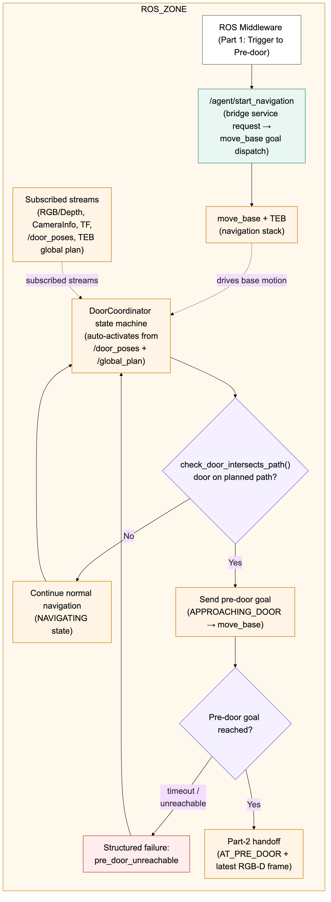
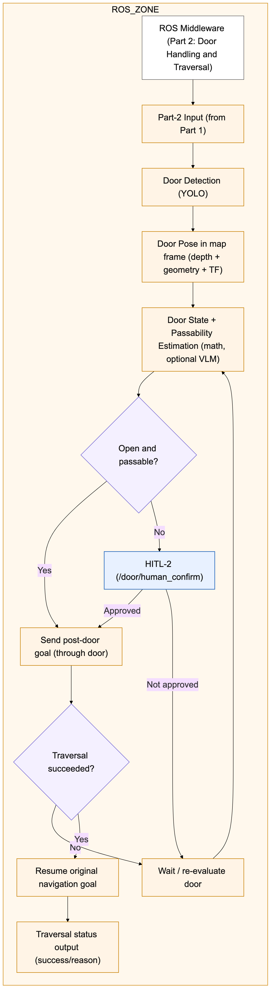

# Door Navigation

ROS Noetic package for **indoor navigation through doors** on a Unitree Go1 with a Jetson Orin and a RealSense RGB-D camera. It plugs a lightweight door-perception + coordinator layer on top of an existing `move_base` / AMCL stack, and exposes an agent-facing ROS service so an external LLM guide (running outside ROS) can request navigation over rosbridge.

Agentic RobotDog guide framework (runs outside ROS, drives this package over rosbridge): [**robotdog_guide**](https://github.com/Satya1998-debug/robotdog_guide).

## Architecture highlights

### End-to-end workflow

The complete system connects the human-facing agent, rosbridge service layer, and ROS navigation middleware:

<p align="center">
  
</p>

### ROS navigation and door traversal

The ROS-side flow is split into goal dispatch and path monitoring (Part 1), followed by door perception, passability decisions, human approval, and traversal (Part 2):

<p align="center">
  
  
</p>

---


## Short system overview

**Runtime flow of one navigation request:**

1. LLM tool calls `/agent/start_navigation` (person, room) via rosbridge.
2. `robot_command_bridge` looks up the pose in `saved_locations_*.yaml`, publishes it on `/goal` (remapped to `move_base_simple/goal`), and blocks in `GoalManager.wait_for_target_reached(...)`.
3. `move_base` drives; `door_detect_pose_estimate_node` publishes `/door_poses` at ~5 Hz.
4. `door_coordinator_node` watches the current global plan; when a door intersects the plan it preempts `move_base`, drives to a **pre-door** pose, calls `/door/estimate_state` (YOLO + DepthAnythingTRT + VLM), optionally asks a human via `/voice/speak` + `/voice/listen`, and on approval drives to a **post-door** pose and resumes the original goal.
5. `GoalManager` returns success (or a failure reason) to the bridge, which returns it to the agent.

**Essential files and their overviews:**

- `scripts/robot_command_bridge.py` — exposes `/agent/start_navigation`.
- `scripts/goal_sender.py` — `GoalManager` (goal publish + arrival wait).
- `scripts/door_detect_pose_estimate_node.py` — perception (YOLO + depth).
- `scripts/door_state_estimator_node.py` — state estimation service.
- `scripts/door_coordinator_node.py` — state machine that supervises door crossings.
- `scripts/voice_assistant_node.py` — audio hardware owner + `/voice/speak`, `/voice/listen`.
- `scripts/voice_assistant.py` — library used by the node (local mode) and by the coordinator (ros-service mode).
- `launch/door_navigation.launch` — camera + perception + coordinator + voice.
- `launch/door_agent_bringup.launch` — the above + rosbridge + `robot_command_bridge`.

---


## Documentation index


| Doc                                                                                | What it covers                                                                                                                                                              |
| ---------------------------------------------------------------------------------- | --------------------------------------------------------------------------------------------------------------------------------------------------------------------------- |
| `[SETUP.md](SETUP.md)`                                                             | Workspace bootstrap, cv_bridge for Python 3.8, RealSense wrapper, catkin build, transformer models (DepthAnythingV2, YOLO, VLM via Ollama), rosbridge, TensorRT conversion. |
| `[internet_setup.md](internet_setup.md)`                                           | Getting the Jetson online via the IAS PC (`192.168.123.148`), then Uni-Stuttgart Wi-Fi, then back onto the Go1 LAN.                                                         |
| `[time_sync_setup.md](time_sync_setup.md)`                                         | Chrony topology PC↔Jetson↔Go1, the strict "never install `systemd-timesyncd` on the Jetson" rule, per-boot procedure, verification checklist, troubleshooting.              |
| `[commands.md](commands.md)`                                                       | Day-to-day cheatsheet: sourcing the workspace, camera launch, `move_base`, goal sender, per-node run commands, rosbridge, rosbag recording/playback, TensorRT commands.     |
| `[setup_issues_jetson_env.md](setup_issues_jetson_env.md)`                         | Jetson-specific gotchas (Python venv, PyTorch wheels, ROS bridge `attrs`/`twisted` fix).                                                                                    |
| `[unitree_go1_steps.md](unitree_go1_steps.md)`                                     | Go1 remote-controller, calibration, power-on/off sequence, high-level vs low-level mode.                                                                                    |
| `[TRT_ENGINE_PERFORMANCE_ACHIEVEMENTS.md](TRT_ENGINE_PERFORMANCE_ACHIEVEMENTS.md)` | DepthAnythingV2 TRT vs PyTorch benchmark notes.                                                                                                                             |


---


## Quick start (assumes `SETUP.md` is done and clocks are in sync)

> Prerequisite (per boot): PC ↔ Jetson ↔ Go1 clock sync green (see `[time_sync_setup.md](time_sync_setup.md)`). If clocks drift, TF and rosbridge will fail in confusing ways.

The Go1 owns `roscore` and the base navigation stack. The Jetson runs perception, the door pipeline, rosbridge, and the LLM guide. Every Jetson terminal expects the workspace to be sourced and pointed at the dog's master:

```bash
source ~/satya/catkin_ws/devel/setup.bash
export ROS_MASTER_URI=http://192.168.123.15:11311   # roscore runs on the Go1
export ROS_HOSTNAME=192.168.123.147 # jetson's IP (static)
```


### 1. On the Go1 — base navigation + `roscore`

SSH into the dog and launch its navigation package. This brings up `roscore`, the map, LIO-SAM localization, `move_base`, and TEB in one shot:

```bash
ssh unitree@192.168.123.15 # login to Go1 to run the Nav Stack
cd /home/unitree/UnitreeSLAM/catkin_ws_3d/src/Go1_nav
roslaunch go1_nav go1_navigation.launch \
    map_file:=/home/unitree/.../map_area_04.yaml
```

The map used here **must match** the `saved_locations_map_area_04.yaml` used on the Jetson in steps 2–3, otherwise stored poses land in the wrong frame.

### 2. On the Jetson — initial pose + auxiliary bringup

**2a. Publish the initial pose to** `/initialpose` (LIO-SAM/AMCL will refine it with ICP once the camera and lidar are streaming):

```bash
rosrun door_navigation set_initial_pose.py \
    --location home \
    --yaml $(rospack find door_navigation)/saved_locations_map_area_04.yaml
```

**2b. Launch the auxiliary stack** — camera, rosbridge websocket (`:9090`), `robot_command_bridge` (`/agent/start_navigation`), and the voice assistant node:

```bash
roslaunch door_navigation auxilary_launch.launch
```

`robot_command_bridge` and `GoalManager` auto-pick a `saved_locations*.yaml` from the package. If you keep multiple maps, force the right one explicitly:

```bash
roslaunch door_navigation auxilary_launch.launch \
    locations_yaml:=$(rospack find door_navigation)/saved_locations_map_area_04.yaml
```


### 3. On the Jetson — door pipeline

Either bring up all three door nodes together:

```bash
roslaunch door_navigation door_navigation.launch
```

Or run them individually when debugging one at a time:

```bash
rosrun door_navigation door_detect_pose_estimate_node.py   # YOLO + DepthAnythingTRT -> /door_poses
rosrun door_navigation door_state_estimator_node.py        # /door/estimate_state service (VLM + geometry)
rosrun door_navigation door_coordinator_node.py            # state machine driving pre/post-door poses
```


### 4. On the Jetson — start the LLM guide

Inside the Py 3.10 `robotdog_guide` venv (see the `[robotdog_guide/README.md](../../../robotdog_guide/README.md)`):

```bash
cd ~/satya/robotdog_guide
source .venv/bin/activate
export ROSBRIDGE_HOST=<jetson_ip>
export ROSBRIDGE_PORT=9090
python main.py
```

The graph greets the user, listens, and on a `navigate` tool call reaches `/agent/start_navigation` over rosbridge — the same service `robot_command_bridge` exposed in step 2.

### Optional — trigger a goal directly (no LLM)

From any Jetson terminal, once steps 1 and 2 are up:

```bash
rosservice call /agent/start_navigation "person: ''
room: 'home'"
```

See `[commands.md](commands.md)` for the full command surface.